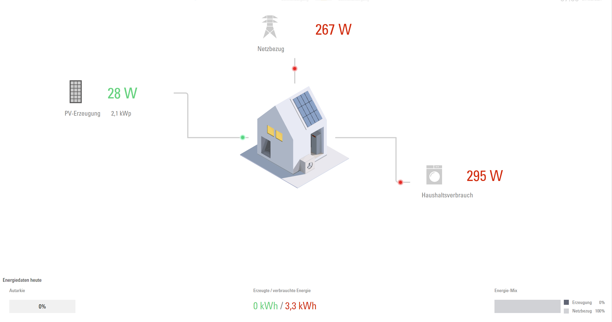

# Viessmann Gridbox Connector

### **<h3 style="text-align: center;">This is not an official Viessmann library</h3>**

Harness the power of your photovoltaic system with the GridboxConnector library. This versatile tool taps into the same REST API as the official dashboard and app, providing you with direct access to your data from the cloud.<br>

Whether you're a developer looking to integrate solar data into your own project, or a power user seeking command-line access, GridboxConnector has you covered. With its dual functionality, you can either embed it into your Python project as a library or use it as a standalone command-line interface (CLI) tool.<br>

**Take control of your solar data with GridboxConnector, and unlock the full potential of your photovoltaic system.**<br><br>


## Installation

```script shell
pip install viessmann-gridbox-connector
```

## Usage

You can use the CLI to retrieve live data from the Viessmann Gridbox API or use the GridboxConnector class in your own code. <br>
Use your Login data from the App or from https://mygridbox.viessmann.com/login

### CLI

```script shell
pip install viessmann-gridbox-connector
viessmann --username <username> --password <password>
```

### in your code

```python
from viessmann_gridbox_connector import GridboxConnector
from importlib.resources import path
import json

with path('viessmann_gridbox_connector', 'config.json') as config_file:
    with open(config_file, 'r') as file:
        data = json.load(file)
        data["login"]["username"] = "username"
        data["login"]["password"] = "password"
        connector = GridboxConnector(data)
        # Retrieve live data
        live_data = connector.retrieve_live_data()
        print(live_data)
```

### Example Output

```script json
{
    "consumption": 496,
    "directConsumption": 413,
    "directConsumptionEV": 0,
    "directConsumptionHeatPump": 0,
    "directConsumptionHeater": 0,
    "directConsumptionHousehold": 413,
    "directConsumptionRate": 1,
    "grid": 83,
    "gridMeterReadingNegative": 4318200000,
    "gridMeterReadingPositive": 14499360000,
    "measuredAt": "2023-08-04T11:29:43Z",
    "photovoltaic": 413,
    "production": 413,
    "selfConsumption": 413,
    "selfConsumptionRate": 1,
    "selfSufficiencyRate": 0.8326612903225806,
    "selfSupply": 413,
    "totalConsumption": 496
}
```

## Dependencies

- requests

## Contributing

If you'd like to contribute to viessmann-gridbox-connector, please follow these steps:

Fork the repository.
Create a new branch for your feature or bug fix.
Make your changes and write tests if possible.
Run tests and ensure they pass.
Submit a pull request.

## License

This project is licensed under the MIT License - see the LICENSE file for details.
